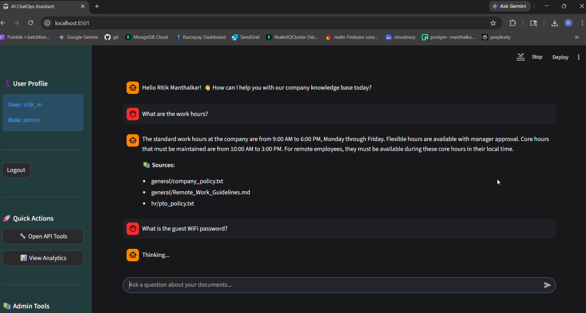
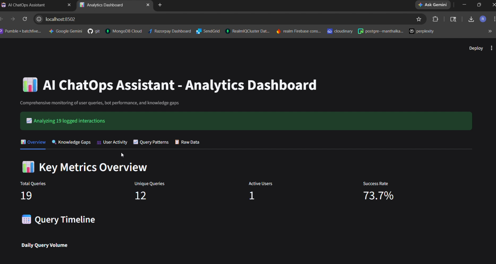
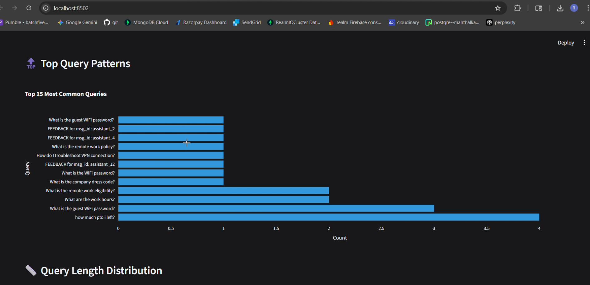

# 🤖 AI ChatOps Assistant

🚀 **Enterprise AI Assistant with RAG, Role-Based Access Control, and Local LLM**

A production-ready AI system that enables employees to query internal knowledge using natural language—with secure access control, real-time analytics, and fully local processing.

💡 Demonstrates end-to-end system design: **ingestion → embedding → retrieval → generation → analytics**

---

## 🧠 System Architecture

```text
                ┌────────────────────────────┐
                │        User Query          │
                └────────────┬───────────────┘
                             │
                             ▼
                ┌────────────────────────────┐
                │  Role-Based Access Control │
                │   (RBAC Filtering)         │
                └────────────┬───────────────┘
                             │
                             ▼
                ┌────────────────────────────┐
                │  Vector Search (ChromaDB)  │
                └────────────┬───────────────┘
                             │
                ┌────────────┴───────────────┐
                │                            │
                ▼                            ▼
     ┌─────────────────────┐     ┌─────────────────────┐
     │ Retrieved Documents │     │ JSON Snapshot Fallback│
     └────────────┬────────┘     └────────────┬────────┘
                  │                           │
                  └────────────┬──────────────┘
                               ▼
                ┌────────────────────────────┐
                │     Context Assembly       │
                └────────────┬───────────────┘
                             │
                             ▼
                ┌────────────────────────────┐
                │ Local LLM (Mistral/Zephyr)│
                │ via CTransformers         │
                └────────────┬───────────────┘
                             │
                             ▼
                ┌────────────────────────────┐
                │ Answer + Source Citations  │
                └────────────────────────────┘
```

---

## ✨ Key Features

### 🔐 Authentication & Security

* Google OAuth SSO + username/password (bcrypt)
* Role-based access control (Admin, HR, Engineering, etc.)
* Sensitive data redaction in logs

---

### 🧠 AI Knowledge Assistant

* Retrieval-Augmented Generation (RAG)
* LangChain-based agent executor
* Smart routing:

  * PTO queries → API
  * Knowledge queries → RAG
* Clean responses with source attribution

---

### 📚 Knowledge Base System

* Multi-format ingestion:

  * PDF, TXT, DOCX, Markdown
* Chunking + embeddings pipeline
* ChromaDB vector storage
* JSON snapshot fallback (fault-tolerant design)

---

### 📊 Analytics Dashboard

* Query volume tracking
* Knowledge gap detection
* User activity insights
* Interactive charts (Plotly)

---

### 🎫 API Integrations

* HR system (PTO, employee data)
* Ticket system (create, assign, update)
* API usage tracking

---

### 📝 Logging & Feedback

* JSONL + CSV logging
* User feedback (👍 / 👎)
* Query-response tracking

---

## 🛠️ Tech Stack

| Layer        | Technology                                |
| ------------ | ----------------------------------------- |
| UI           | Streamlit                                 |
| Backend      | Python                                    |
| AI Framework | LangChain                                 |
| LLM          | Mistral / Zephyr (GGUF via CTransformers) |
| Embeddings   | HuggingFace                               |
| Vector DB    | ChromaDB                                  |
| Auth         | Google OAuth + bcrypt                     |
| Analytics    | Pandas + Plotly                           |

---

## 📸 Demo

### 🤖 Chat Interface


### 📊 Analytics Dashboard


### 📈 Query Insights


## 📂 Project Structure

```bash
chat-assistant/
├── app.py
├── analytics_enhanced.py
├── query.py
├── ingest.py
├── llm_loader.py
├── api_integrations.py
├── auth_google.py
├── config.yaml
├── requirements.txt
├── knowledge_base/
└── Dockerfile
```

---

## 🚀 Quick Start

```bash
pip install -r requirements.txt
python ingest.py
streamlit run app.py
```

👉 Access: http://localhost:8501

> ⚠️ Default credentials are for demo purposes only. Update before production use.

---

## 📚 Knowledge Base

The `knowledge_base/` directory contains **sample documents** used for demonstration.

All files are **dummy data** created to simulate enterprise policies and workflows.

---

## 📊 Analytics Dashboard

```bash
streamlit run analytics_enhanced.py --server.port 8502
```

👉 Access: http://localhost:8502

---

## 🐳 Docker Deployment

```bash
docker-compose up -d
```

---

## 🔥 Advanced Features

* Role-aware document filtering
* Hybrid retrieval (Vector + Snapshot fallback)
* LLM output sanitization
* Source citation generation
* Auto re-indexing
* Session-based agents

---

## 📌 Notes

* `db/` (vector database) is excluded from repo
* Run ingestion before querying
* Models are downloaded locally

---

## 🚀 Future Improvements

* Cloud deployment (AWS / GCP)
* Hybrid search (BM25 + vector)
* Conversation memory
* Multi-tenant support

---

## 📝 License

This project is for demonstration and portfolio purposes.

---

## 👨‍💻 Author

**Rutvik M**
GitHub: https://github.com/Rutvik-M

---
